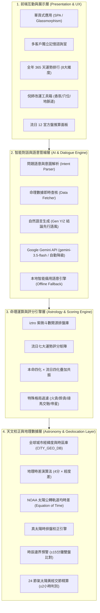

# 紫微斗數流日命理運算系統 — 專案藍圖 (Project Blueprint)

結合 iztro 排盤引擎、Google Gemini LLM 自然語言理解、倪海廈天紀改運體系的現代化智能命理運算系統架構設計藍圖。

---

## 一、專案願景

建立一套「知命 → 造命 → 修命」的完整命理系統，讓使用者能：
1. **知命**：精準排出本命盤、大運、流年、流月、流日、流時，校正地理經緯度與天文均時差（真太陽時）。
2. **造命**：找出偏財日、桃花日、貴人日、商機日，以全年 365 天評分引擎量化吉凶，提前佈局重大決策。
3. **修命**：透過倪海廈天紀改運體系（中藥聞香、經絡穴位、陽宅地脈道天子位、空間鹽水淨化）主動調和身心磁場。

---

## 二、系統總體架構

本系統採用分層解耦設計，共分為四大核心層級：



---

## 三、核心技術模組規格

### 1. 天文與真太陽時校正引擎 (Astro Calibration Module)
* **地理時差 (Geographic Longitude Offset)**：
  $$\Delta t_{\text{geo}} = 4 \times (\lambda_{\text{local}} - \lambda_{\text{meridian}}) \quad (\text{分鐘})$$
  其中 $\lambda_{\text{local}}$ 為出生地經度，$\lambda_{\text{meridian}}$ 為標準時區中央經線（例如台北為 $120^\circ\text{E}$，曼谷為 $105^\circ\text{E}$）。
* **均時差 (Equation of Time, EOT)**：
  採用 NOAA 太陽公轉軌道均差模型，精算因地球橢圓公轉軌道與黃赤交角導致的視太陽日差異（每年在 $-14.2$ 分鐘至 $+16.4$ 分鐘間變動）：
  $$\gamma = \frac{2\pi}{365} \left( d - 1 + \frac{h - 12}{24} \right)$$
  $$\text{EOT} = 229.18 \times (0.000075 + 0.001868 \cos\gamma - 0.032077 \sin\gamma - 0.014615 \cos 2\gamma - 0.040849 \sin 2\gamma)$$
* **真太陽時 (True Apparent Solar Time)**：
  $$T_{\text{solar}} = T_{\text{clock}} + \Delta t_{\text{geo}} + \text{EOT}$$
  系統全面以真太陽時辰排盤，跨日時自動轉換排盤基準日期。
* **時辰邊界雙盤比對 (Boundary Dual-Chart Compare)**：
  真太陽時距離奇數點時辰交界在 **$\le 15$ 分鐘以內**時，自動排定前後雙時辰命盤，提取命宮主星、五行局、命主身主與格局差異，提醒使用者確認時間。
* **24 節氣天文交節檢測 (Solar Terms Transition)**：
  精算太陽黃經（$0^\circ \sim 360^\circ$），當出生時間在節氣交接 **$\le 2$ 小時**以內時，以真太陽時比對交節前後，確保年柱（生肖）與八字月柱劃分精準。

### 2. 八大運勢流日評分引擎 (Scoring & Ranking Engine)
系統遍歷全年 365 天，針對每位客戶之命盤獨立計算八大維度運勢分值：
1. **偏財日 (Pian Cai)**：流日財帛宮逢化祿 (+3)、祿存 (+3)、天馬 (+2)、破軍 (+2)、武曲 (+2)、貪狼 (+2)，逢化忌 (-3)、地空 (-2)、地劫 (-2)。
2. **樂透運 (Le Tou TOP 10)**：結合八字飛財格、火貪格、鈴貪格、破軍化祿、天相文昌夾命，篩選爆發性暴富能量日。
3. **桃花日 (Tao Hua)**：流日夫妻宮或命宮逢紅鸞 (+3)、天喜 (+2)、廉貞 (+2)、貪狼 (+2)、天姚 (+1.5)。
4. **肉慾日 (Rou Yu)**：貪狼+咸池、天姚、沐浴星曜交會，慾望與吸引力最強峰值日。
5. **貴人日 (Gui Ren)**：流日命宮或遷移宮逢天魁 (+3)、天鉞 (+3)、左輔 (+2)、右弼 (+2)、流日化科 (+2.5)。
6. **事業日 (Shi Ye)**：流日官祿宮逢化權 (+3)、紫微 (+2.5)、天府 (+2)、天魁 (+1.5)、天鉞 (+1.5)。
7. **健康日 (Jian Kang)**：疾厄宮逢天梁 (+3)、化科 (+2.5)、祿存 (+2) 為身心修復日；見化忌、擎羊、陀羅為健康警訊防護日。
8. **巨大商機日 (Shang Ji)**：祿馬交馳、權祿交馳、紫微天府同度、主導權大開之商業簽約談判黃金日。

### 3. Gemini LLM 智能諮詢對話管線 (AI Dialogue Pipeline)
1. **意圖理解 (Understand Question)**：解析使用者問題的主體（本人、合夥人）、事件類型（創業、買彩券、表白）、時間區間與心理動機。
2. **數據查核 (Fetch Astrology Data)**：根據意圖即時查詢當前客戶的星盤、當日流日四化、焦點宮位星曜與運勢得分。
3. **自然語言生成 (Generate Natural Answer)**：
   - 語風：Gen Y / Gen Z 現代朋友聊天語調，**結論先行**，避免死板文言八股。
   - 結構：【白話版結論】+【信號燈號】+【星級評定】+【命盤推算依據】+【倪師改運處方】。
4. **動態容錯降級 (Resilient Fallback)**：
   - 優先調用：`gemini-3.5-flash`
   - 容錯備用：`gemini-2.5-flash` / `gemini-2.0-flash`
   - 離線備用：本地智能命理多維度語意引擎

### 4. 倪海廈天紀改運體系 (Ni Haisha Remedy System)
* **中藥聞香法**：
  - 木日：柴胡薄荷降真開郁香（舒肝解鬱、明目醒腦）
  - 火日：沉香遠志清心安神香（水火既濟、安神開慧）
  - 土日：蒼朮白芷醒脾辟穢香（定中宮脾土、化濕聚財）
  - 金日：白芷辛夷肅肺威儀香（清肅肅降、提升決策威信）
  - 水日：沉香肉桂溫腎固本香（溫補元陽、激發深層靈感）
* **經絡穴位導引**：百會穴（午時升提陽氣）、足三里（辰時調順氣血）、太衝、內關、湧泉穴按揉指引。
* **地脈道空間佈局**：談判簽約坐西北乾卦天子位壓陣，每日推算喜神方、財神方與歲煞避忌方。
* **粗海鹽水淨化法**：辟除空間病氣穢氣，重置身心磁場。

### 5. 多客戶記憶隔離架構 (Multi-Session Client Management)
* 每個客戶具備獨立 `sessionId`，生日、出生地、真太陽時、排盤星曜、全年排行榜與對話歷史完全記憶隔離。
* 支援自訂客戶名稱、即時切換、本地持久化儲存（`localStorage`）。

---

## 四、系統目錄結構

```
ziwei-fortune/
├── webapp/                      # 系統核心網頁應用與後端服務
│   ├── index.html               # 現代 SPA 介面 (對話/排行榜/改運工具箱/彈窗)
│   ├── app.js                   # 前端應用總控制器 (真太陽時、評分、LLM、UI)
│   ├── server.js                # Node.js 原生 HTTP 伺服器與 REST API
│   ├── styles.css               # 深色系玻璃擬態 UI 樣式系統
│   ├── iztro.min.js             # 紫微斗數開源計算核心庫
│   ├── test_solar_system.js     # 真太陽時天文校正 6 大單元測試腳本
│   └── data/                    # 預先計算之流日評分快取數據
├── scripts/                     # 數據批次生成與命理評分除錯腳本
│   ├── scoring_engine.js        # 評分引擎獨立模組
│   ├── run_ranking.js           # 全年數據批次生成器
│   └── test_*.js                # 各模組自動化驗證腳本
├── .env.example                 # 環境變數範本 (不含機密)
├── .gitignore                   # Git 檔案忽略規則
├── LICENSE                      # MIT 開源授權條款
├── README.md                    # 專案公開說明文件
└── PROJECT_BLUEPRINT.md         # 專案系統架構藍圖 (本文件)
```

---

## 五、未來演進路線圖 (Roadmap)

### Phase 1：基礎核心建置（已完成 ✅）
- [x] 真太陽時天文校正（地理時差 + NOAA 均時差公式）
- [x] 時辰邊界預警（前後 15 分鐘雙命盤對照）
- [x] 二十四節氣黃經精算（前後 2 小時交節校正）
- [x] 全年 365 天八大運勢評分引擎與排行榜
- [x] Google Gemini LLM 對話管線與動態模型容錯降級
- [x] 倪師天紀改運體系（聞香、穴位、地脈道、鹽水法）
- [x] 多客戶獨立記憶隔離諮詢室
- [x] 繁體中文 / 泰文即時切換

### Phase 2：深度命理功能擴展（規劃中 🚀）
- [ ] **流時預測**：將流日運勢細化至 12 個雙小時（流時四化與吉凶時段）。
- [ ] **八字 × 紫微合盤**：四柱八字喜忌神與斗數星曜三方四正交叉印證。
- [ ] **日曆訂閱導出**：支援將個人專屬偏財日、貴人日、商機日導出為 iCal / Google 日曆事件。
- [ ] **PDF 專屬年度命理報告**：一鍵輸出客戶專屬全年運勢與改運手冊。

### Phase 3：智能化與多模態生態（遠期展望 🌟）
- [ ] **3D 陽宅羅盤虛擬實境**：結合手機陀螺儀即時展示地脈道天子位與喜神方。
- [ ] **AI 語音諮詢師**：結合語音合成（TTS）與語音辨識（STT）實現沉浸式語音命理諮商。
- [ ] **多語系全球化擴展**：新增英語（English）、日語（日本語）、越南語（Tiếng Việt）。

---

## 六、授權與貢獻

本專案遵循 [MIT License](LICENSE) 開源授權協議。  
Copyright (c) 2026 Jack Yang.
